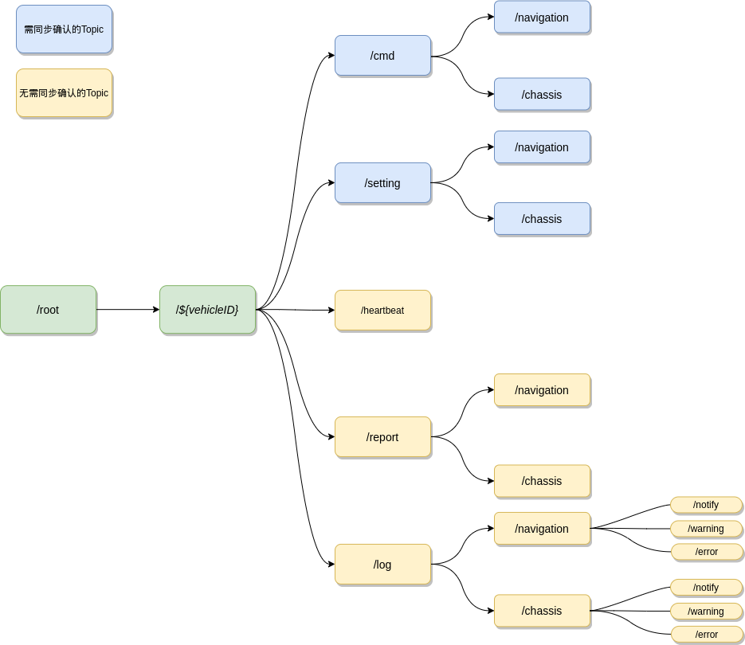

.. _mqtt:

MQTT API
=========

结构图：

``/cmd``
----------

消息类型
 .. list-table::
    :widths: 15 10 30
    :header-rows: 1

    * - KEY
      - VALUE
      - 描述
    * - INIT_POSITION
      - 0
      - 初始化位置
    * - PAUSE
      - 1
      - 暂停
    * - CONTINUE
      - 2
      - 继续
    * - MAPPING_START
      - 3
      - 开始建图
    * - MAPPING_STOP
      - 4
      - 结束建图
    * - MISSION
      - 5
      - 任务
    * - SWITCH_MODE
      - 6
      - 切换模式：0 导航模式，1 手动模式
    * - DRIVE
      - 100
      - 移动

初始化位置
>>>>>>>>>>>
 * Set
    - Topic
       /root/**${vehicleId}**/cmd/navigation/set

    - Content
       .. code-block:: json

          {
              "messageId": 1,
              "timestamp": "%yyyy-%mm-%dd %HH:%MM:%SS",
              "messageType": 0,
              "data": [1, 1, 0, 0, 0, 0, 1]
          }

 * Ack
    - Topic
       /root/**${vehicleId}**/cmd/navigation/ack

    - Content
       .. code-block:: json

          {
              "messageId": 1,
              "timestamp": "%yyyy-%mm-%dd %HH:%MM:%SS",
              "messageType": 0,
              "data": {
                "code": 0
              }
          }

 * Notify
    - Topic
       /root/**${vehicleId}**/cmd/navigation/notify

    - Content
       .. code-block:: json

          {
              "messageId": 1,
              "timestamp": "%yyyy-%mm-%dd %HH:%MM:%SS",
              "messageType": 0,
              "data": {
                "code": 0
              }
          }

暂停
>>>>
 * Topic
     /root/**${vehicleId}**/cmd/navigation/set

 * Content
     .. code-block:: json

        {
            "messageId": 1,
            "timestamp": "%yyyy-%mm-%dd %HH:%MM:%SS",
            "messageType": 1,
            "data": null
        }

继续
>>>>
 * Topic
    /root/**${vehicleId}**/cmd/navigation/set

 * Content
    .. code-block:: json

        {
            "messageId": 1,
            "timestamp": "%yyyy-%mm-%dd %HH:%MM:%SS",
            "messageType": 2,
            "data": null
        }

开始建图
>>>>>>>>
 * Topic
    /root/**${vehicleId}**/cmd/map/set

 * Content
    .. code-block:: json

        {
            "messageId": 1,
            "timestamp": "%yyyy-%mm-%dd %HH:%MM:%SS",
            "messageType": 3,
            "data": {
                "name": "map_name"
            }
        }

结束建图
>>>>>>>>
 * Topic
    /root/**${vehicleId}**/cmd/map/set

 * Content
    .. code-block:: json

        {
            "messageId": 1,
            "timestamp": "%yyyy-%mm-%dd %HH:%MM:%SS",
            "messageType": 4,
            "data": {
                "name": "map_name"
            }
        }

任务
>>>>
 * Topic
    /root/**${vehicleId}**/cmd/navigation/set

 * Content
    .. code-block:: json

        {
            "messageId": 1,
            "timestamp": "%yyyy-%mm-%dd %HH:%MM:%SS",
            "messageType": 5,
            "data": [
              {
                "action": "MOVE_TO_POSITION",
                "parameters": {
                  "path": [0, 0, 1, 1]
                }
              },
              {
                "action": "WAIT",
                "parameters": {
                  "seconds": 50
                }
              },
              {
                "action": "MOVE_TO_POSITION",
                "parameters": {
                  "path": [0, 0, 10, 10]
                }
              },
              {
                "action": "OPEN_CUTTER",
                "parameters": {
                  "cutter": true
                }
              },
              {
                "action": "COVERAGE",
                "parameters": {
                  "path": [0, 0, 10, 10, 20, 20]
                }
              },
              {
                "action": "CLOSE_CUTTER",
                "parameters": {
                  "cutter": false
                }
              },
              {
                "action": "CHARGING",
                "parameters": {
                  "time": 0
                }
              }
            ]
        }

切换模式
>>>>>>>>
 * Topic
    /root/**${vehicleId}**/cmd/navigation/set

 * Content
    .. code-block:: json

        {
            "messageId": 1,
            "timestamp": "%yyyy-%mm-%dd %HH:%MM:%SS",
            "messageType": 6,
            "data": 0
        }

移动
>>>>>>>>
 * Topic
    /root/**${vehicleId}**/cmd/chassis/set

 * Content
    .. code-block:: json

        {
            "messageId": 1,
            "timestamp": "%yyyy-%mm-%dd %HH:%MM:%SS",
            "messageType": 100,
            "data": {
                "linear": 0.5,
                "angular": 0.5
            }
        }

----

``/setting``
-------------

消息类型
 .. list-table::
    :widths: 15 10 30
    :header-rows: 1

    * - KEY
      - VALUE
      - 描述
    * - SET_MAP
      - 0
      - 设置地图
    * - SET_LNG_LAT
      - 设置经纬度
      - 100

设置地图
>>>>>>>>
 * Topic
    /root/**${vehicleId}**/setting/map/set

 * Content
    .. code-block:: json

        {
            "messageId": 1,
            "timestamp": "%yyyy-%mm-%dd %HH:%MM:%SS",
            "messageType": 0,
            "data": "地图名"
        }

设置经纬度
>>>>>>>>>>
 * Topic
    /root/**${vehicleId}**/setting/navigation/set

 * Content
    .. code-block:: json

        {
            "messageId": 1,
            "timestamp": "%yyyy-%mm-%dd %HH:%MM:%SS",
            "messageType": 100,
            "data": [123.0145612, 23.41576123, 34]
        }

-----------

``/heartbeat``
----------------

下行
>>>>>>

 * Topic
    /root/**${vehicleId}**/heartbeat/set

 * Content
    .. code-block:: json

        {
            "timestamp": "%yyyy-%mm-%dd %HH:%MM:%SS",
        }

上行
>>>>>>>>
 * Topic
    /root/**${vehicleId}**/heartbeat/notify

 * Content

    .. code-block:: json

        {
            "timestamp": "%yyyy-%mm-%dd %HH:%MM:%SS",
        }

----------

``/report``
-----------

定位相关
>>>>>>>>
 * Topic
    /root/**${vehicleId}**/report/navigation/localization
 * Content
    .. code-block:: json

        {
            "timestamp": "%yyyy-%mm-%dd %HH:%MM:%SS",
            "data": {
                "pose": [[1,1,1], [1,1,1,1]],
                "scan": [1,1,1,1,1,1],
                "status": 0
            }
        }

障碍物相关
>>>>>>>>>>
 * Topic
    /root/**${vehicleId}**/report/navigation/obstacle
 * Content
    .. code-block:: json

        {
            "timestamp": "%yyyy-%mm-%dd %HH:%MM:%SS",
            "data": {
                "obstacle": [1,1,1],
                "distance": 1,
                "angle": 23.9
            }
        }

电池相关
>>>>>>>>
 * Topic
    /root/**${vehicleId}**/report/chassis/battery
 * Content
    .. code-block:: json

        {
            "timestamp": "%yyyy-%mm-%dd %HH:%MM:%SS",
            "data": {
                "charged": true,
                "percentage": 40.2,
                "voltage": 52.6,
                "current": 5.76,
                "temperature": 40
            }
        }

系统占用
>>>>>>>>
  * Topic
     /root/**${vehicleId}**/report/navigation/usage
  * Content
     .. code-block:: json

        {
            "timestamp": "%yyyy-%mm-%dd %HH:%MM:%SS",
            "data": {
                "cpu": 52.6,
                "memory": 5.76,
            }
        }

底盘基本信息
>>>>>>>>>>>>>>
  * Topic
     /root/**${vehicleId}**/report/chassis/general
  * Content
     .. code-block:: json

        {
            "timestamp": "%yyyy-%mm-%dd %HH:%MM:%SS",
            "data": {
                "linear": 0.83,
                "angular": 0.34,
            }
        }

导航基本信息
>>>>>>>>>>>>>>>>
  * Topic
     /root/**${vehicleId}**/report/chassis/general
  * Content
     .. code-block:: json

        {
            "timestamp": "%yyyy-%mm-%dd %HH:%MM:%SS",
            "data": {
                "mapping": true,
                "moving": false,
            }
        }

--------

``/log``
----------

错误码
>>>>>>>>
  .. list-table::
    :widths: 15 10 10 10 30
    :header-rows: 1

    * - KEY
      - VALUE
      - 等级
      - 模块
      - 描述
    * - LOCALIZATION_ERROR
      - 100
      - ERROR
      - 定位
      - 定位失败
    * - GPS_ERROR
      - 101
      - ERROR
      - 定位
      - GPS定位失败
    * - LOW_BATTERY
      - 200
      - WARNING
      - 电池
      - 低电量
    * - FULL_BATTERY
      - 200
      - NOTIFY
      - 电池
      - 充满电
    * - RECHARGE_ERROR
      - 200
      - ERROR
      - 电池
      - 充电失败
    * -
      -
      -
      -
      - 进入虚拟墙
    * -
      -
      -
      -
      - 无底盘反馈
    * -
      -
      -
      -
      - 节点无响应
    * -
      -
      -
      -
      - 遇障
    * -
      -
      -
      -
      - 停障
    * -
      -
      -
      -
      - 绕障
    * -
      -
      -
      -
      - 避障失败
    * -
      -
      -
      -
      - 读取导航地图失败
